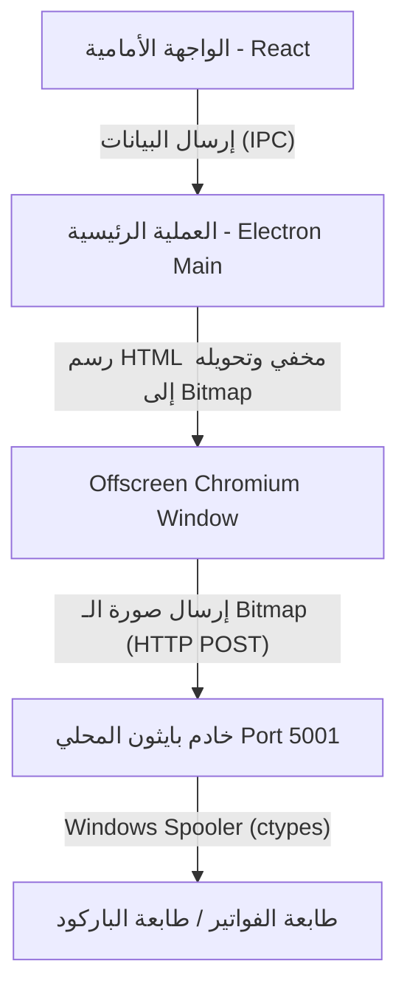

# تقرير التحليل الفني الشامل ونقاط الخلل في نظام طباعة الكاشير والباركود

تم إجراء تحليل معمق ومراجعة فنية شاملة لكود مشروع نظام الكاشير والمخازن لقطع غيار السيارات (برمجيات Electron و Python print server و React). يركز هذا التقرير على نقاط الخلل والمشاكل البرمجية والهيكلية التي تؤثر على كفاءة عملية الطباعة الحرارية للفواتير وملصقات الباركود، مع تقديم شرح فني دقيق لكل مشكلة وحلول برمجية مقترحة (Code Diffs) لتصحيحها.

---

## 1. الهيكل العام لنظام الطباعة الحالي (Architecture Flow)

يعتمد النظام الحالي على طريقة هجينة لطباعة الفواتير والباركود:
1. **الواجهة الأمامية (React)**: تقوم بإرسال البيانات عبر قنوات IPC (عمليات نقل البيانات بين العمليات) إلى ملف العملية الرئيسي في Electron (`main.js`).
2. **العملية الرئيسية (Electron Main Process)**: تنشئ نافذة متصفح مخفية (Offscreen Window) وتقوم بتحميل كود HTML ديناميكي بداخلها، ثم تقوم بالتقاط محتوياتها كصورة نقطية (Capture Page) وتحويلها إلى مصفوفة 1-bit مدمجة (Monochrome Bitmap).
3. **خادم الطباعة المحلي (Python Print Server)**: يتم إرسال الصورة النقطية عبر بروتوكول HTTP POST إلى خادم محلي مكتوب بلغة بايثون يعمل على المنفذ `5001`. يقوم الخادم بالاتصال المباشر بمنفذ الطباعة في نظام التشغيل (Windows Spooler عبر ctypes أو Linux lpstat) وتمرير كود الطباعة الخام (ESC/POS للفواتير أو TSPL للباركود).



---

## 2. جدول ملخص المشاكل المكتشفة وتأثيرها (Bug Matrix)

| # | المشكلة الفنية | مكان الخلل في الكود | مستوى الخطورة | التأثير على النظام |
|---|---|---|---|---|
| **1** | **توقف طباعة الباركود عند انقطاع الإنترنت (CDN Dependency)** | `electron/main.js` & `BarcodePrintScreen.tsx` | **حرج جداً (Critical)** | تطبع ملصقات الباركود كأرقام نصية صغيرة جداً وغير قابلة للمسح بالليزر بدلاً من أعمدة الباركود. |
| **2** | **انهيار خادم بايثون واقتطاع المؤشرات في Windows 64-bit** | `print_server.py` (ctypes) | **حرج (High)** | فشل فتح منافذ الطباعة Spooler بسبب تدمير عناوين الذاكرة المقتطعة من 64 إلى 32 بت. |
| **3** | **فشل طباعة الفواتير لعدم وجود طابعة افتراضية احتياطية** | `electron/main.js` (`print-receipt`) | **عالي (High)** | تتوقف طباعة الكاشير تماماً إذا لم يختر المستخدم يدوياً اسم الطابعة من شاشة الإعدادات. |
| **4** | **تأخر واختفاء خط الفواتير (Cairo Font Google CDN)** | `electron/main.js` (قوالب HTML) | **متوسط (Medium)** | ظهور الفواتير بنصوص فارغة أو بخطوط افتراضية مشوهة عند ضعف أو انقطاع الإنترنت. |
| **5** | **تشوه وتضييق عرض التقارير المالية على رول 80 مم** | `electron/main.js` (`print-report`) | **متوسط (Medium)** | يظهر التقرير في نصف عرض رول الورق فقط (290px بدلاً من 576px) مع فراغات كبيرة. |
| **6** | **رسالة مسار أرشيف الفواتير المضللة للعميل** | `SettingsScreen.tsx` | **منخفض (Low)** | يوجه الكود المستخدم لمجلد وهمي في مسار المشروع بينما يتم الحفظ الفعلي في مجلد AppData المخفي. |
| **7** | **التقاط صفحة الباركود المخفية فوراً دون انتظار الرسم** | `electron/main.js` (سطر 943+) | **متوسط (Medium)** | احتمالية تصوير وطباعة ملصقات بيضاء فارغة لعدم إعطاء Chromium فرصة لرسم الباركود. |
| **8** | **تعارض منفذ خادم الطباعة (Port 5001 Conflict)** | `print_server.py` & `main.js` | **متوسط (Medium)** | توقف الطباعة بالكامل إذا كان هناك برنامج آخر على الجهاز يستخدم المنفذ 5001. |

---

## 3. التحليل الفني المفصل للمشاكل (Root Cause Analysis)

### المشكلة الأولى: الاعتماد على الـ CDN الخارجي لـ JsBarcode
في الكود المسؤول عن توليد الباركود، يتم استدعاء مكتبة `JsBarcode` من خلال رابط CDN خارجي:
```html
<script src="https://cdn.jsdelivr.net/npm/jsbarcode@3.11.5/dist/JsBarcode.all.min.js"></script>
```
* **سبب المشكلة**: عند تشغيل الكاشير في بيئة عمل محلية بدون اتصال بالإنترنت (وهي الحالة الطبيعية لأجهزة نقاط البيع POS)، يفشل تحميل هذا الملف البرمجي. وبسبب وجود كتلة `try-catch` داخل كود التوليد:
  ```javascript
  } catch(e) {
    document.getElementById('bc').outerHTML = '<div style="font-size:7px;font-family:monospace;text-align:center">${lbl.barcode}</div>';
  }
  ```
  يتم استبدال الباركود الرسومي بنص صغير عادي.
* **النتيجة**: لا يتم رسم خطوط الباركود الإرشادية، وبالتالي لا يستطيع قارئ الباركود (Barcode Scanner) التعرف على السلعة في شاشة المبيعات.

---

### المشكلة الثانية: عدم تحديد `argtypes` و `restype` لعمليات ctypes في Windows Spooler
في ملف `print_server.py` يتم استيراد وظائف `winspool.drv` ديناميكياً للاتصال بنظام الطباعة في ويندوز:
```python
OpenPrinter = ctypes.windll.winspool.OpenPrinterW
StartDocPrinter = ctypes.windll.winspool.StartDocPrinterW
WritePrinter = ctypes.windll.winspool.WritePrinter
```
* **سبب المشكلة**: في لغة بايثون، عندما تستدعي وظائف C++ الخارجية عبر مكتبة `ctypes` بدون تعريف صريح لأنواع المتغيرات المدخلة (`argtypes`) والمخرجة (`restype`)، تفترض المكتبة تلقائياً أن جميع المتغيرات والمخرجات هي أعداد صحيحة بحجم 32 بت (`32-bit integers`).
* **النتيجة**: في بيئة تشغيل ويندوز 64 بت (وهي المعتمدة حالياً للعملاء)، تكون عناوين مؤشرات المقابض (Pointers/Handles) بحجم 64 بت. عند تمرير مقبض الطابعة `hPrinter` من وظيفة `OpenPrinterW` إلى وظيفة `StartDocPrinter` أو `WritePrinter` يتم اقتطاع الجزء العلوي من عنوان الذاكرة (Truncation) مما يؤدي إلى فشل فوري للعملية وظهور رسائل خطأ مثل `Failed to write printer command bytes` أو انهيار كامل لعملية البايثون (Access Violation).

---

### المشكلة الثالثة: غياب آلية الكشف التلقائي عن الطابعة الافتراضية للفواتير
في دالة معالجة طباعة الفواتير `print-receipt` بملف `electron/main.js`:
```javascript
let printerName = '';
try {
  const settings = await handlers.getSettings();
  printerName = settings.selected_printer_name || '';
} catch (err) { ... }
```
* **سبب المشكلة**: الكود يحاول جلب اسم الطابعة المحددة من جدول الإعدادات فقط. إذا كان النظام جديداً أو لم يقم المسؤول باختيار طابعة بشكل يدوي في الإعدادات، يظل متغير `printerName` قيمة فارغة `''`.
* **النتيجة**: يتم تمرير قيمة فارغة إلى خادم بايثون ويفشل استدعاء `OpenPrinterW` وتفشل طباعة الفاتورة تماماً دون توجيه المستخدم لوجود مشكلة. بينما في كود الباركود توجد دالة ذكية `autoDetectLabelPrinter` تقوم بالبحث التلقائي في الطابعات الموصولة بالجهاز.

---

### المشكلة الرابعة: الارتباط الخارجي لخط Cairo وتأثيره على سرعة الرسم
تستخدم الفواتير والتقارير المالية خط `Cairo` لتحسين المظهر الجمالي باللغة العربية، ولكن يتم استدعاؤه برابط خارجي:
```html
<link href="https://fonts.googleapis.com/css2?family=Cairo:wght@400;700;900&display=swap" rel="stylesheet">
```
* **سبب المشكلة**: محرك Chromium المخفي يحاول تحميل ملف الخط عبر الشبكة عند رسم الفاتورة. وفي دالة `printRawImageViaPython` ينتظر الكود `150` مللي ثانية فقط كمهلة لإعادة التدفق (Reflow) ثم يلتقط الصورة.
* **النتيجة**: إذا كانت سرعة الإنترنت بطيئة أو منعدمة، يتم التقاط الصورة قبل تحميل الخط بالكامل مما يؤدي إلى:
  1. اختفاء كامل للنصوص (Flash of Invisible Text) لتصبح الفاتورة المطبوعة فارغة تماماً.
  2. استخدام خط Arial الافتراضي للويندوز بشكل سيئ وتغيير أبعاد الفقرات مما يتسبب في خروج النصوص عن حواف الورقة الحرارية وتداخل الكلمات.

---

### المشكلة الخامسة: خلل العرض الثابت في قوالب التقارير المالية
تتم طباعة التقارير المالية الدورية باستخدام رول عريض بمقاس 80 مم (ما يعادل عرض `576` بكسل)، ولكن قالب الـ CSS للتقرير يحتوي على عرض ثابت وضيق جداً:
```css
body {
  width: 290px;
  margin: 0;
  padding: 10px;
  ...
}
```
* **سبب المشكلة**: يتم تشغيل صفحة التقاط التقارير بعرض نافذة كامل `576px` في Electron بينما يتم قصر محتوى الفاتورة الفعلي في كود الـ CSS على `290px`.
* **النتيجة**: يطبع التقرير المالي متقلصاً جداً في الجانب الأيمن من الورقة مع ترك مساحة فارغة شاسعة وغير مستغلة في الجانب الأيسر، مما يجعله غير احترافي ويصعب قراءة الأرقام المالية الحساسة مثل الأرباح الصافية والمبيعات.

---

### المشكلة السادسة: الالتباس في مسار حفظ أرشيف الفواتير
في شاشة الإعدادات `SettingsScreen.tsx`:
```javascript
const handleOpenLogsFolder = async () => {
  const opened = await dbClient.openPrintLogsFolder();
  if (!opened) {
    showAlert('المجلد متاح بداخل مسار المشروع باسم "print_logs"', 'success');
  }
};
```
* **سبب المشكلة**: ينبه الكود المستخدم أن الأرشيف يقع بداخل مسار المشروع باسم `print_logs`. لكن في كود Electron الرئيسي، يتم إنشاء وحفظ الصور بداخل مسار بيانات المستخدم الخاصة بالنظام (AppData):
  ```javascript
  const getPrintLogsDir = () => {
    const dir = path.join(app.getPath('userData'), 'print_logs');
    ...
  }
  ```
* **النتيجة**: لن يجد المستخدم مجلد الصور بداخل مسار التطبيق، مما يجعله يظن أن ميزة الاحتفاظ بنسخ الفواتير معطلة أو لا تعمل.

---

## 4. الحلول البرمجية المقترحة والتعديلات المطلوبة (Proposed Fix Diffs)

لتصحيح هذه المشاكل بالكامل وجعل نظام الطباعة ذو موثوقية عالية ويعمل بشكل محلي 100% بدون إنترنت، يجب تطبيق التعديلات التالية:

### تعديل 1: إصلاح مؤشرات ويندوز 64 بت في ملف `print_server.py`
يجب تعريف أنواع المدخلات والمخرجات بصورة صارمة لمنع اقتطاع الذاكرة:

```diff
  # Windows Spooler functions using ctypes to avoid requiring pywin32 module
  try:
      OpenPrinter = ctypes.windll.winspool.OpenPrinterW
      ClosePrinter = ctypes.windll.winspool.ClosePrinter
      StartDocPrinter = ctypes.windll.winspool.StartDocPrinterW
      EndDocPrinter = ctypes.windll.winspool.EndDocPrinter
      StartPagePrinter = ctypes.windll.winspool.StartPagePrinter
      EndPagePrinter = ctypes.windll.winspool.EndPagePrinter
      WritePrinter = ctypes.windll.winspool.WritePrinter
      
      class DOC_INFO_1(ctypes.Structure):
          _fields_ = [
              ("pDocName", ctypes.c_wchar_p),
              ("pOutputFile", ctypes.c_wchar_p),
              ("pDatatype", ctypes.c_wchar_p)
          ]
+
+     # تعريف صارم للأنواع لمنع انهيار الـ Handles في بيئة 64-bit
+     OpenPrinter.argtypes = [ctypes.c_wchar_p, ctypes.POINTER(ctypes.c_void_p), ctypes.c_void_p]
+     OpenPrinter.restype = ctypes.c_long
+     
+     ClosePrinter.argtypes = [ctypes.c_void_p]
+     ClosePrinter.restype = ctypes.c_long
+     
+     StartDocPrinter.argtypes = [ctypes.c_void_p, ctypes.c_ulong, ctypes.POINTER(DOC_INFO_1)]
+     StartDocPrinter.restype = ctypes.c_ulong
+     
+     EndDocPrinter.argtypes = [ctypes.c_void_p]
+     EndDocPrinter.restype = ctypes.c_long
+     
+     StartPagePrinter.argtypes = [ctypes.c_void_p]
+     StartPagePrinter.restype = ctypes.c_long
+     
+     EndPagePrinter.argtypes = [ctypes.c_void_p]
+     EndPagePrinter.restype = ctypes.c_long
+     
+     WritePrinter.argtypes = [ctypes.c_void_p, ctypes.c_void_p, ctypes.c_ulong, ctypes.POINTER(ctypes.c_ulong)]
+     WritePrinter.restype = ctypes.c_long
  except Exception as e:
      OpenPrinter = None
```

---

### تعديل 2: دعم الكشف التلقائي عن طابعة الفواتير الافتراضية
تعديل كود معالجة طباعة الفواتير في `electron/main.js` ليدعم اختيار طابعة النظام الافتراضية تلقائياً عند غياب الإعداد اليدوي:

```diff
  // Direct print via local Python Print Server
  const widthPx = paperWidth === '58mm' ? 384 : 576;
  const widthMm = paperWidth === '58mm' ? 58 : 80;
  
+ // التحقق من وجود اسم طابعة وإلا البحث عن الطابعة الافتراضية
+ if (!printerName) {
+   try {
+     const list = await mainWindow.webContents.getPrintersAsync();
+     const defaultPrinter = list.find(p => p.isDefault) || list[0];
+     if (defaultPrinter) printerName = defaultPrinter.name;
+   } catch (e) {
+     console.error('Failed to get default system printer for receipt:', e);
+   }
+ }
+
  printRawImageViaPython(htmlContent, 'escpos', printerName, widthMm, 0, widthPx, 0)
    .then(() => console.log('Python ESC/POS print job sent.'))
    .catch((err) => console.error('Python ESC/POS print failed:', err));
```

---

### تعديل 3: تضمين مكتبة الباركود محلياً والتخلص من الـ CDN والإنترنت
لتسريع وتأمين النظام ضد انقطاع الشبكة:
1. يتم حفظ كود مكتبة `JsBarcode` محلياً داخل مجلد المشروع (مثلاً في `electron/lib/JsBarcode.all.js`).
2. يتم قراءة الملف بترميز Base64 وتضمينه مباشرة في قالب الـ HTML المرسل للـ Spooler، أو حقنه كملف محلي.
3. التعديل في `main.js`:

```diff
- <script src="https://cdn.jsdelivr.net/npm/jsbarcode@3.11.5/dist/JsBarcode.all.min.js"></script>
+ <script>
+   // تضمين محلي للمكتبة لتعمل أوفلاين بالكامل
+   ${fs.readFileSync(path.join(__dirname, 'lib/JsBarcode.all.js'), 'utf8')}
+ </script>
```

---

### تعديل 4: حل مشكلة الخطوط عن طريق استخدام خطوط النظام الأساسية دون تحميل خارجي
بدلاً من تحميل خطوط Google Fonts عبر الشبكة، يُنصح باستخدام خطوط النظام المتاحة على نظام ويندوز الداعم للغة العربية:

```diff
- <link href="https://fonts.googleapis.com/css2?family=Cairo:wght@400;700;900&display=swap" rel="stylesheet">
  <style>
    body {
      width: 100%;
      margin: 0;
      padding: 6px;
-     font-family: 'Cairo', Arial, sans-serif;
+     font-family: 'Segoe UI', 'Tahoma', 'Arial', sans-serif;
      color: #000;
      background: #fff;
      font-size: 13px;
    }
```
*(خط `Segoe UI` و `Tahoma` هي خطوط نظام قياسية في جميع إصدارات ويندوز الحديثة، تمتاز بوضوحها الفائق عند الطباعة الحرارية النقطية ولا تحتاج اتصال بالإنترنت).*

---

### تعديل 5: إصلاح عرض التقارير المالية ليتناسب مع رول 80 مم بالكامل
تعديل مقياس الـ CSS ليتناسب مع المساحة الفعلية للطباعة:

```diff
  <style>
    body {
-     width: 290px;
+     width: 100%;
      margin: 0;
      padding: 10px;
      font-family: 'Segoe UI', Tahoma, sans-serif;
      color: #000;
      background: #fff;
      font-size: 11px;
    }
  </style>
```

---

### تعديل 6: تصحيح مهلة رسم الباركود المخفي قبل التقاط الشاشة
في `electron/main.js` عند طباعة ملصق باركود بمقاس محدد ثابت، يجب ترك مهلة لرسم الباركود قبل الالتقاط:

```diff
  offscreenWindow.webContents.once('did-finish-load', async () => {
    try {
      let finalHeight = heightPx;
      if (!finalHeight) {
        // If height is not fixed (like dynamic receipts), read scrollHeight
        const scrollHeight = await offscreenWindow.webContents.executeJavaScript('document.body.scrollHeight');
        finalHeight = scrollHeight + 15;
        offscreenWindow.setBounds({ x: 0, y: 0, width: widthPx, height: finalHeight });
        // Wait short delay for reflow
        await new Promise(r => setTimeout(r, 150));
+     } else {
+       // مهلة قصيرة لرسم الباركود والخطوط ديناميكياً قبل الالتقاط
+       await new Promise(r => setTimeout(r, 80));
      }
```

---

## 5. خطة العمل الموصى بها (Action Plan)

1. **الخطوة الأولى (عاجلة)**: تطبيق تعديل الـ Spooler في ملف `print_server.py` لمنع انهيار الخادم على ويندوز 64-بت لدى العملاء.
2. **الخطوة الثانية (عاجلة)**: تحميل وتثبيت مكتبة `jsbarcode` محلياً داخل مجلد المشروع وإلغاء استدعاء الـ CDN الخارجي من ملف `electron/main.js` و `BarcodePrintScreen.tsx` لضمان عمل طابعة الباركود عند انقطاع الإنترنت.
3. **الخطوة الثالثة (تحسين تجربة العميل)**: تعديل قالب التقارير المالية لتوسيع مساحة الطباعة وحل مشكلة الخطوط الخارجية (Cairo) لتسريع وتأمين الطباعة أوفلاين.
4. **الخطوة الرابعة**: مراجعة رسائل تنبيهات النظام في ملف `SettingsScreen.tsx` وتحديث النص ليوضح للمستخدم كيفية الوصول المباشر لمجلد صور الفواتير.

---
*تم إعداد هذا التقرير كمرجع فني لفريق التطوير لحل مشاكل طباعة الكاشير والباركود بالكامل.*
